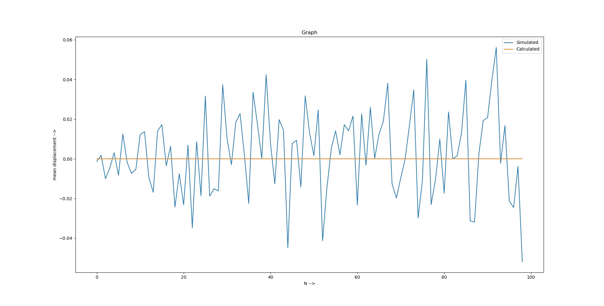

# Question 1
## Random Walk simulation

### **Part 1**
> Find probability of meeting again after N steps
#### Code Explanation 
- Probability is calculated mathematically to show on graph
- First loop for N i.e. number of steps
- Second loop for 10000 simulations for each N
- Third loop for calculating the last postion after N steps in each simulation
- Counter is maintained for simulation where drunkers meets
- This counter is divided by number of simulations to get Simulated probability
- Later inserted into an list with value of N
- Later Ploted on graph along with calculated Values.
#### Code
```
# Question number 1 ( meeting Drunker wala )
import matplotlib.pyplot as plt
import random
import math

y_1 = []

for i in range(1,101):
    val = math.comb(2*i,i)
    y_1.insert(i,val/(math.pow(4,i)))

y_2 = []

for i in range(1,100):
    val = 0
    for j in range(1,10001):
        pos_1 = 0
        pos_2 = 0
        for k in range(1,i+1):
            pos_1 = pos_1 + math.floor(random.choice([-1,1]))
            pos_2 = pos_2 + math.floor(random.choice([-1,1]))
        if( pos_1 == pos_2):
            val = val + 1
    y_2.insert(i,val/10000)

plt.figure(figsize=(20,20))
plt.ylabel("P(N) -->")
plt.xlabel("N -->")
plt.title('Graph')
plt.plot(y_1,label='Calculated')
plt.plot(y_2,label='Simulated')
plt.legend()
plt.show()
```
#### Results


### **Part 2**
> Find probability of a drunk to be at Origin
#### Code Explanation
- Probability is calculated mathematically to show on graph
- First loop for N i.e. number of steps
- Second loop for 10000 simulations for each N
- Then position is calculated for any on of the drunk.
- If final position is 0 then counter is increased.
- Counter is divided by number of siluations to get avg
- ploted on the graph
#### Code
```
#Related question no #1 at origin which is "0"
import matplotlib.pyplot as plt
import random
import math

y_1 = []

for i in range(1,101):
    if(i%2==1):
        y_1.insert(i,0)
    else:
        I = int(i/2)
        val = math.comb(i,I)
        y_1.insert(i,val/(math.pow(2,i)))

y_2 = []

for i in range(1,100):
    val = 0
    for j in range(1,10001):
        pos_1 = 0
        for k in range(1,i+1):
            pos_1 = pos_1 + math.floor(random.choice([-1,1]))
        if( pos_1 == 0):
            val = val + 1
    y_2.insert(i,val/10000)

plt.figure(figsize=(20,20))
plt.ylabel("Probability -->")
plt.xlabel("N -->")
plt.title('Graph')
plt.plot(y_2,label='Simulated')
plt.plot(y_1,label='Calculated')
plt.legend()
plt.show()
```
#### Result


### **Part 3**
> Mean displacement of the drunk
#### Code Explanation
- Calculated mean displacement is 0
- First loop for number of steps i.e. N
- Second loop for number of simulation i.e. 120000
- Third loop for calculating position after N steps
- Insert Mean in list
- Plot the graph
#### Code
```
# mean displacement
import matplotlib.pyplot as plt
import random
import math

y_1 = []

y_2 = []

for i in range(1,100):
    val = 0
    for j in range(1,120001):
        pos_1 = 0
        for k in range(1,i+1):
            pos_1 = pos_1 + math.floor(random.choice([-1,1]))
        val += pos_1
    y_2.insert(i,val/120000)
    #print(val)
    y_1.insert(i,0)

plt.figure(figsize=(20,20))
plt.ylabel("mean displacement -->")
plt.xlabel("N -->")
plt.title('Graph')
plt.plot(y_2,label='Simulated')
plt.plot(y_1,label='Calculated')
""" 
plt.ylabel("Frequency -->")
plt.xlabel("deviation -->")  # for histogram
plt.hist(y_2)
"""
plt.legend()
plt.show()
```
#### Result


### **Part 4**
> Mean Square displacement
#### Code Explanation
- Calculated mean displacement is N ( N is number of steps)
- First loop for number of steps i.e. N
- Second loop for number of simulation i.e. 120000
- Third loop for calculating position after N steps
- Insert Square Mean in list
- Plot the graph
#### Code
```
# mean Squared displacement
import matplotlib.pyplot as plt
import random
import math

y_1 = []

y_2 = []

for i in range(1,101):
    val = 0
    for j in range(1,10001):
        pos_1 = 0
        for k in range(1,i+1):
            pos_1 = pos_1 + math.floor(random.choice([-1,1]))
        val += ((pos_1)*(pos_1))
    y_2.insert(i,val/10000)
    y_1.insert(i,i)

plt.figure(figsize=(20,20))
plt.ylabel("Mean squared displacement -->")
plt.xlabel("N -->")
plt.title('Graph')
plt.plot(y_2,label='Simulated')
plt.plot(y_1,label='Calculated')
plt.legend()
plt.show()
```
#### Result
