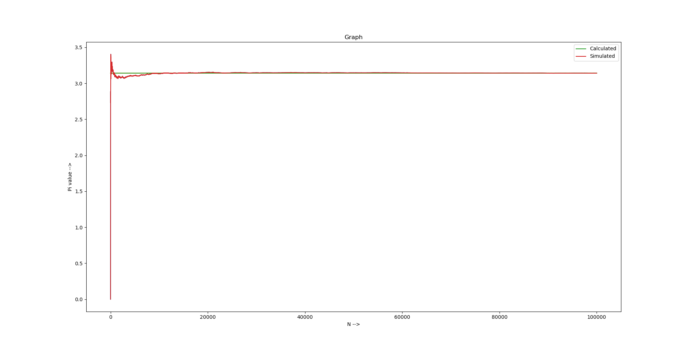

# Question 2
## Calculation of Value of 𝝿 using Monte Carlo
### Report & Code Explanation
- For loop for 100000 pins faling at at random x and y position in a square
- Found using equation of usint circle pins that are falling inside the unit circle
- Counted all these pins
- divided by total number of Pins that Fell.
- This is done for every value of N (i.e. Pins)

### Code 
```
# Question number 2 ( value of pi )
import matplotlib.pyplot as plt
import random
import math

val = 0
y_1 = []
arr = []

for i in range(1,100001):
    x_pos = random.random()
    y_pos = random.random()
    if ( x_pos*x_pos + y_pos*y_pos <= 1):
        val += 1
    arr.insert(i,4*val/i)
    y_1.insert(i,math.pi)

plt.figure(figsize=(20,20))
plt.ylabel("Pi value -->")
plt.xlabel("N -->")
plt.title('Graph')
plt.plot(y_1,label='Calculated')
plt.plot(arr,label='Simulated')
plt.legend()
plt.show()
```
### Formula Used
> 𝝿 = 4 * (𝝿 * (r * r)/ (2r * 2r))

### Results :
